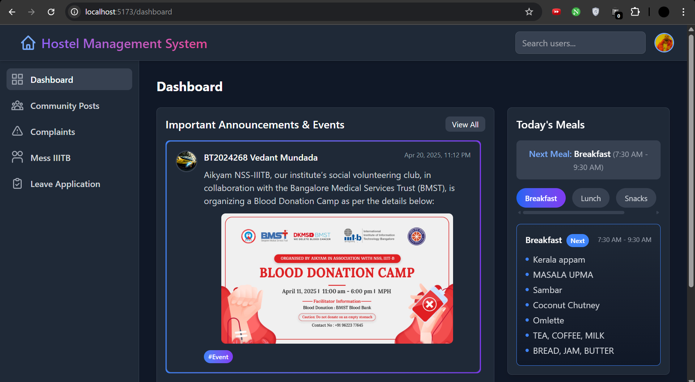
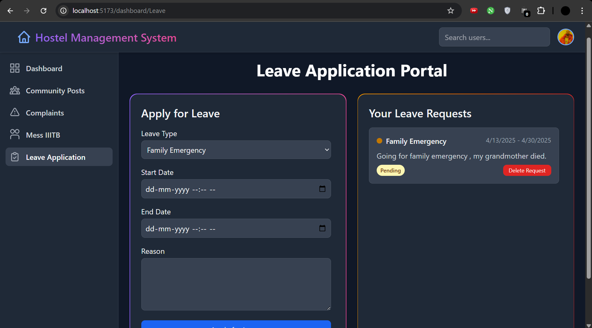
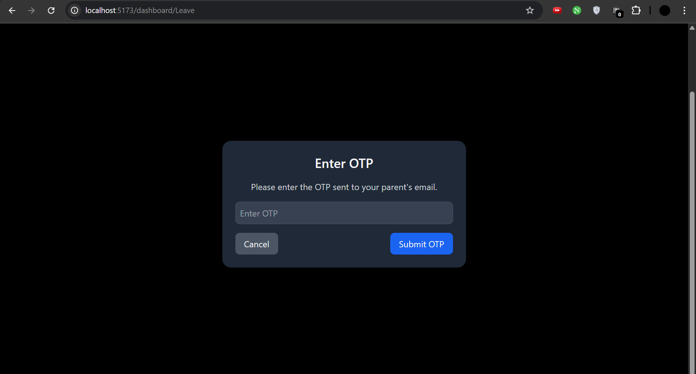
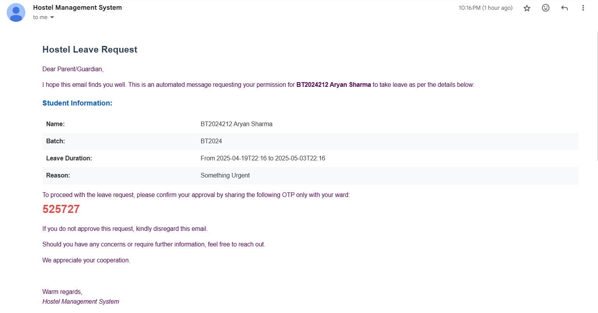
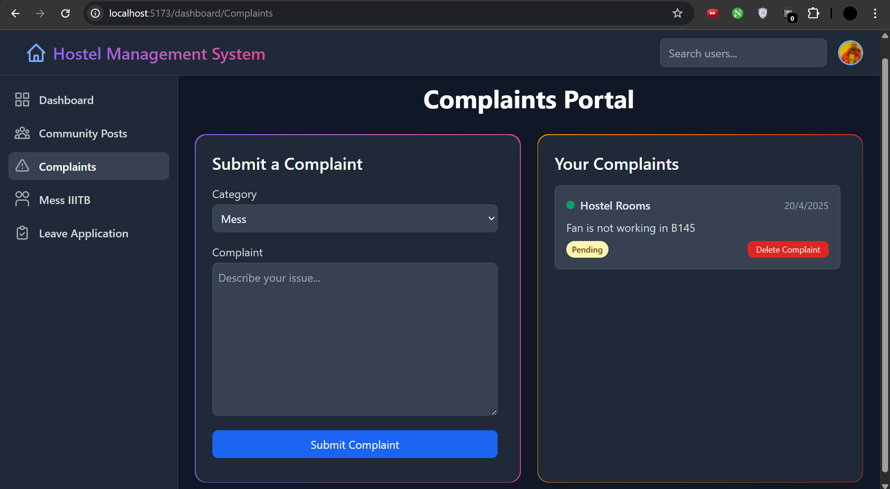
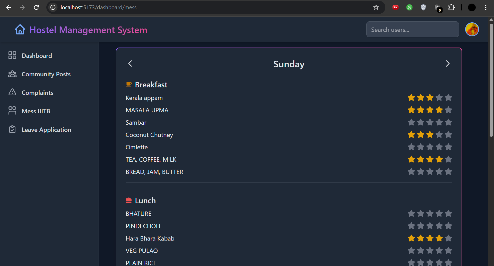

# 🏨 Hostel Management System – IIIT Bangalore

A full-stack application built to digitize and streamline hostel operations at **IIIT Bangalore**. This system simplifies complaint registration, leave management, mess feedback, and more — all on a centralized platform for both students and administrators.

[](https://github.com/Haxous742/Hostel-Management-System.git)

---

## 📌 Table of Contents

- [Features](#-features)
- [Tech Stack](#-tech-stack)
- [Installation Guide](#-installation-guide)
- [Usage](#-usage)
- [Implementation Overview](#-implementation-overview)
- [Database & Data Models](#-database--data-models)

---

## ✨ Features

### 🧑‍🏫 For Students:
- **Dashboard**: View recent community posts, daily mess menu, upcoming meal, and student birthdays.
- **Community Posts**: Share or view updates, events, and hostel notices.
- **Mess IIITB**: View daily menu and rate food quality.
- **Complaints**: File complaints for mess, rooms, gym, MPH, etc.
- **Leave Application**: Apply for leave with OTP verification sent to registered parent email.
- **Profile**: View and update personal details including profile picture.

### 🧑‍💼 For Admins:
- Access and manage student complaints and leave applications.

---

## 🛠 Tech Stack

- **Frontend**: React (Vite), Tailwind CSS, Flowbite React  
- **Backend**: Node.js, Express.js  
- **Database**: MongoDB (Atlas)  
- **Authentication**: JWT tokens, nodemailer  

---

## ⚙️ Installation Guide

### Prerequisites

- Node.js (v18 or higher)  
- npm (v9 or higher)  
- Git  
- MongoDB (local or MongoDB Atlas)  

### Steps

1. **Clone the Repository**:
   ```bash
   git clone https://github.com/Haxous742/Hostel-Management-System.git
   cd Hostel-Management-System
   ```

2. **Set Up Frontend**:
   ```bash
   cd client
   npm install
   ```

3. **Set Up Backend**:
   ```bash
   cd ../server
   npm install
   ```

5. **Run the Application**:

   For the simplicity of the installations, we have given out our API keys in the `./env` file. We understand that this is not a good practice.

   - In one terminal, run frontend:
     ```bash
     cd client
     npm run dev
     ```
     Visit: [http://localhost:5173](http://localhost:5173)

   - In another terminal, run backend:
     ```bash
     cd server
     node index.js
     ```
     API: [http://localhost:5000](http://localhost:5000)

   -ID and pass for admin are "admin" and "password" respectively.
---

## ⚖️ Implementation Overview

This project has been structured with modularity, clarity, and scalability in mind.

### 🚀 Frontend (React + Tailwind + Flowbite)

- **Folder Structure**: Pages are componentized by feature (e.g., Dashboard, LeaveForm, Complaints, Profile).
- **Routing**: React Router DOM is used to manage navigation between pages, with protected routes for authentication.
- **Community Feed**: Uses context API for shared state of posts and real-time display of top 3 in dashboard.
- **Mess Rating**: Users can give feedback through star ratings; data is synced to the backend.
- **Forms**: Complaint and Leave forms include field validation, dynamic dropdowns, and submit state UX improvements.

### 🧰 Backend (Node.js + Express)

- **Authentication**:
  - JWT tokens are used for secure authentication.
  - Middleware checks for user roles (admin/student) to manage access control.
- **OTP System**:
  - `nodemailer` is integrated to send OTPs to parent email IDs during leave applications.
  - OTPs are hashed and time-limited to enhance security.
- **Leave System**:
  - Two MongoDB collections handle temporary (unverified) and verified leaves.
  - Once OTP is confirmed, the leave is moved to a permanent schema.
- **Complaint Management**:
  - Complaints are stored in MongoDB with `status`, `type`, and `studentId`.
  - Admin routes allow toggling complaint resolution status.

---

## 🧩 Database & Data Models

This project uses **MongoDB** as its database, with **Mongoose** for modeling application data.

The following models are used to structure and manage data:

- **users_model.js**: Master schema storing student registration, login info, parent email, profile photo, and more.
- **complaints_model.js**: Handles student-submitted complaints with fields like `type`, `message`, `status`, and `studentId`.
- **leave_model.js**: Stores verified leave requests post OTP approval with details like `reason`, `type`, `departure`, and `return`.
- **tempLeave_model.js**: Captures temporary leave forms waiting for OTP verification.
- **menu_model.js**: Contains the mess menu data for each day; used for daily display and rating sync.
- **post_model.js**: Holds community post info — text, image, hashtags, timestamp, and author metadata.
- **rating_model.js**: Stores mess food ratings submitted by users for meals (breakfast, lunch, dinner).
- **userVote_model.js**: Tracks user upvotes/downvotes on community posts to ensure one vote per user per post.

Each schema includes:
- Validation rules
- Default timestamps
- Indexes (for some models like posts or complaints) to enhance query performance

These models are interlinked through references (e.g., `studentId` in complaints refers to a user) to maintain consistency and enforce data relations.

---

## ⚖️ Admin Panel

- Admin can see lists of all active complaints and pending leave applications.
- One-click approval or rejection of leaves.


---


### 📸 Image Breakdown – Hostel Management System

---

#### 🖼️ `dashboard.png`

This screenshot displays the **Student Dashboard** – the central hub for all users. It includes:
- The **next upcoming meal** with item details.
- A mini feed showing **top community posts**.
- A birthday section to highlight **students' birthdays**.

The goal is to give students a quick glance at what's new and relevant the moment they log in.

---


#### 🖼️ `leave.png`
This image showcases the **Leave Application Form**:
- Students can submit a leave request by entering details like **departure and return dates**, **reason**, and **type of leave**.
- Parent's email is required, as an **OTP verification system** is tied to the email for security.
- User-friendly dropdowns and input fields make the form intuitive.

---



#### 🖼️ `otpforleave.png`
This image highlights the **OTP Verification Page**:
- Once the leave form is submitted, an OTP is sent to the parent's registered email.
- Students are redirected to this screen to enter the OTP.
- Ensures that **parental awareness and approval** is incorporated in the leave process.

---

#### 🖼️ `otpforleave.png`
This is the mail that goes to the parents.


---


#### 🖼️ `complaints.png`
This screenshot represents the **Complaints Section**:
- Students can file complaints related to **Mess**, **Rooms**, **Gym**, **MPH**, etc.
- Each complaint includes a **type**, **description**, and a **status indicator** (Pending/Resolved).
- Easy tracking of submitted complaints and status updates promotes transparency.

---


#### 🖼️ `menu.png`
The image here is of the **Mess Menu Interface**:
- Daily menu displayed in a clean layout (Breakfast, Lunch, and Dinner).
- Students can view upcoming meals.
- Each meal can be **rated**, and the feedback goes directly into the backend for administrative review.

---


#### 🖼️ `otpforleave.png`
This image highlights the **OTP Verification Page**:
- Once the leave form is submitted, an OTP is sent to the parent's registered email.
- Students are redirected to this screen to enter the OTP.
- Ensures that **parental awareness and approval** is incorporated in the leave process.

---

These visuals reflect a modern, clean, and practical user interface aimed at improving the experience of both students and admins in managing hostel-related workflows.


This implementation demonstrates clean RESTful design, proper schema validation, and a user-friendly interface for both students and admins.

